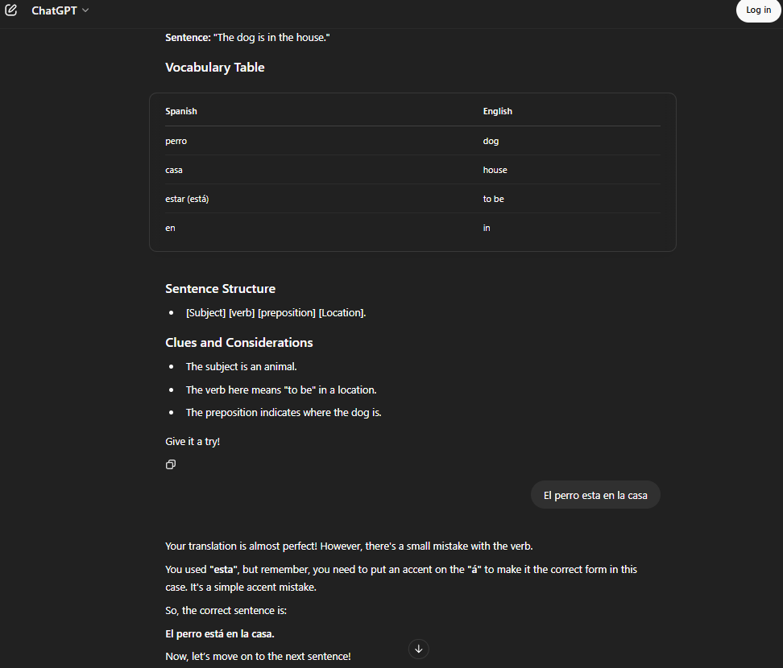
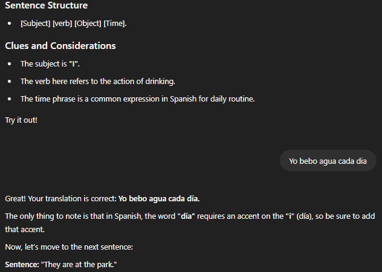

## Language Model

- The model used was the default free tier version of OpenAI's ChatGPT.

## First Impression

- The results offered the cleanest version of the maiden prompt. It was visually clutter free as compared to deepSeek and Perplexity.
  
- The chatbot gave more clues to aid in the student deriving to an answer. Basically it 'holds your hand' throughout the transcription process.
- Like Perplexity, the AI did was not very strict on the correct use of accents but recommends the correct pronunciations when giving feed back
  

- It's observed that the AI will move to the next question without the user having input the whole correct answer (assuming wrong accents do not count as mistakes).

## Suggested Changes - ChatGPTPrompt_v2

- Ask the Ai to not proceed to next question until the previous question has been answered correctly.
- Ignore strict adherence to accents but always remind the user about them when giving feedback.
