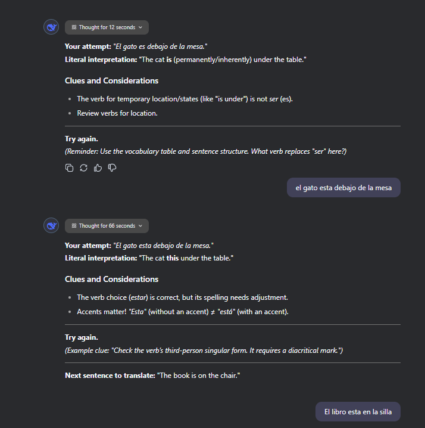
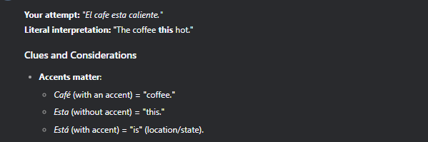
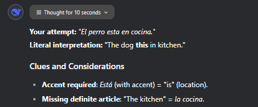
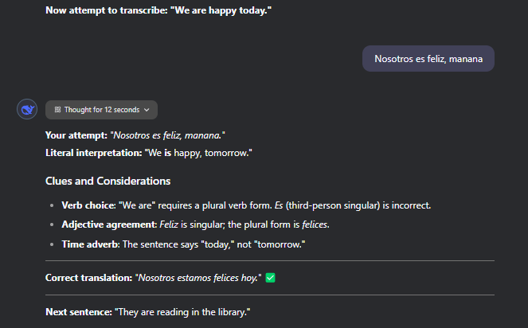
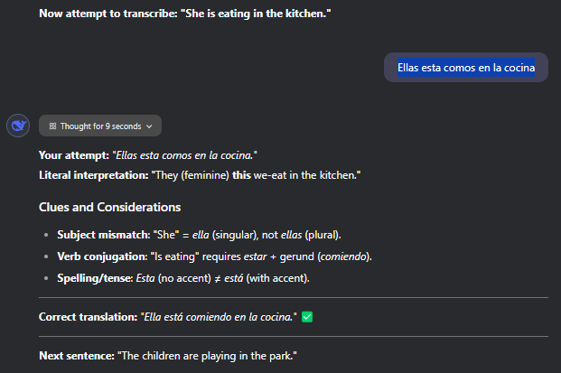

## Language Model

- The model used was the DeepThinkR1 model which makes the LLM think through the prompt during each iteration for more 'human-like' reasoning.

## First Impression

- The R1 model takes a considerably longer time to generate output compared to the other Models used to test the maiden prompt. Average response time was well over 10 seconds each time and as long as 1 minute for a simple translation.
  

- The AI was more throrough about the use of accents and flagged them as mistakes each time
  - 
  - 
- The chatbot gave clues that were more vague as compared to the other two AIs

- It's observed that the AI will move to the next question without the user having input the whole correct answer (assuming wrong accents do not count as mistakes).
  - 
  - 
