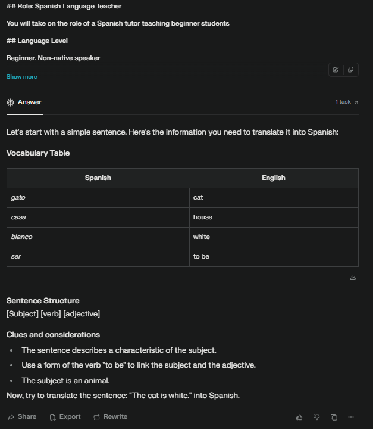
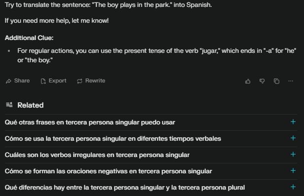

## Language Model

- The model used was the default search funtion avialable on Perplexity

## First Impression

- Generally works well each time it is run. Gives a more hands-on approach than DeepSeek model but not as 'helpful' as ChatGPT.

- Probably the fastest of the 3 AI models used to test the maiden prompt.
- Visual wise, it is less cluttered than DeepSeek but in some cases, still offers some more post links which are not relevant to the task at hand.
  
- The only AI so far that does not automatically move to the next question until it is answered correctly.
